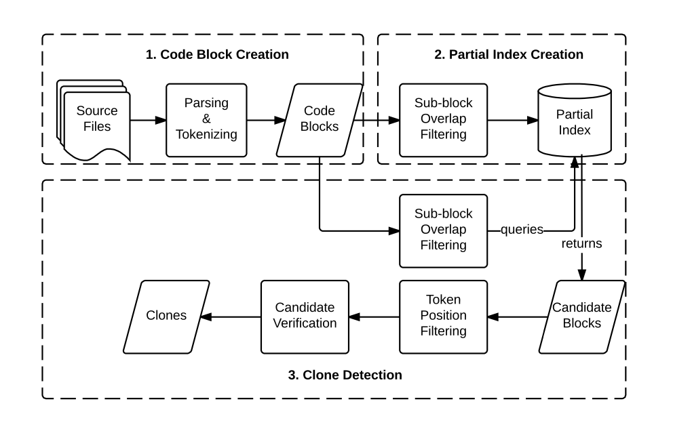

# Introduction

程序员在开发过程中经常会从其他项目中copy代码并进行重构，理想情况是在修改代码的同时，程序员会同步地修改注释。 然而也存在着代码或注释只有一方被修改的情况， 此时便发生了注释-代码的不一致( comment-code inconsistency ).

为了方便分析，我们将项目 $P$ 分割成一个个文本块, 文本块有代码和注释部分, 即代码块和注释块.

A software project $P$ is represented as a set of text blocks $P : \{B1,\dots,Bn\}$

A code block B is consisted of its code part and comment part $B: \{B_{\mathrm{code}}, B_{\mathrm{comment}} \}$

# Goal

给定程序块$A$和外部代码库中的程序块$B, C, \dots$, 我们的目的是**找出clone了$A$并发生了copy-refactor, 导致注释-代码不一致情况的程序块.** 

首先我们对$B, C, \dots$中的每一个, 判定它们是否与$A$具有clone关系. 假设找到$B$与$A$具有clone关系.

接着, 我们要分析$B$在clone过程中是否发生了注释-代码不一致. 我们将$B$与$A$做比较，判定$B$的注释-代码一致性。 

由于程序块由代码块和注释两部分组成，我们的分析也分为两部分： (1) 分析$B$和$A$的代码是否一致。  (2) 分析$B$和$A$的注释是否一致。当且仅当$A$, $B$在(1)(2)中均一致，我们才认为$B$的注释-代码具有一致性。  

# 总思路

1. 首先我们有一个基准项目$P_1$, 和外部项目$P_2, P_3, \dots$. 我们要分析外部项目对$P_1$的copy-refactor情况和comment-code inconsistency情况
2. 我们将$P_1, P_2, P_3, \dots$分割为程序块.
3. 对程序块使用[judge_Comment_Code_Consistentency](#核心思路( judge_Comment_Code_Consistentency ))算法, 检测出外部项目中的符合我们目的的程序块

# 核心思路( judge_Comment_Code_Consistentency )

1. 对于程序块$B_1, B_2, \dots$. 将其两两比较, 确定哪些程序块具有clone关系. 一个程序块是clone的, 当且仅当它的代码块是clone的. 假设具有clone关系的程序块为$B_1, B_2$.
2. 判断$B_1, B_2$的代码是否一致. 
3. 判断$B_1, B_2$的注释是否一致.
4. 如果$B_1, B_2$的代码和注释只有一方不一致, 则判定发生了comment-code inconsistency

# 实现

对于步骤1和2, 我参考了论文[Large-Scale Code Clone Detection](https://escholarship.org/uc/item/45r2308g), 其中有Type3 clone detection技术和程序块比较的优化技术. 后者减少了大量程序块两两比较的复杂度, 使得步骤1在大型代码库分析中成为可行. 步骤2“代码是否一致”的判断, 可以用Type3 clone detection来解决.

对于步骤3, 我参考了论文[CPC: Automatically Classifying and Propagating Natural Language Comments via Program Analysis](https://doi.org/10.1145/3377811.3380427), 可以将注释先进行分类, 再进行比较, 提高Precision.

# 问题

* 我看了一些code clone deection的文献综述, 里面说这方面工具有三个measure:

  * accurate detection of near-miss clones,

  * scalability
  * minimal dependency on programming languages.

  第一个是方法本身的效果, 后两个都是追求工具的Performance. 我们的论文要不要将Performance也作为重点呢? 还是说只着眼于comment-code inconsistency检测算法?

* [实现](#实现)部分只是我看了两篇论文得出的结果, 可能不够先进和全面. 比如判定“是否具有clone关系”, 是否可以用Type4 clone作为依据? 再比如代码和注释的一致性判定, 都可以有别的算法.

# Clone Detection Method

接下来说下[Large-Scale Code Clone Detection](https://escholarship.org/uc/item/45r2308g)中的方法, 它是基于token的:

定义:

* A software project $P$ is represented as a set of code blocks $P : \{B1,\dots,Bn\}$

* A code block $B$, in turn, is represented as a bag-of-tokens (multiset) $B : {T1...,Tk}$. 

问题规约为:

Given two projects $P_x$ and $P_y$, a similarity function $f$, and a threshold $θ$, the aim is to find all the code block pairs (or groups) $P_x.B$ and $P_y.B$  s.t $f(P_x.B,P_y.B) ≥ ⌈ θ · max(|P_x.B|, |P_y.B|) ⌉$

简单来说就是把每个程序块用一个scanner提取出token, 每个block也就是若干个token的集合, 比较两个block是否具有clone关系, 也就是计算出两个集合的并集的模, 看是否大于某个阈值.

